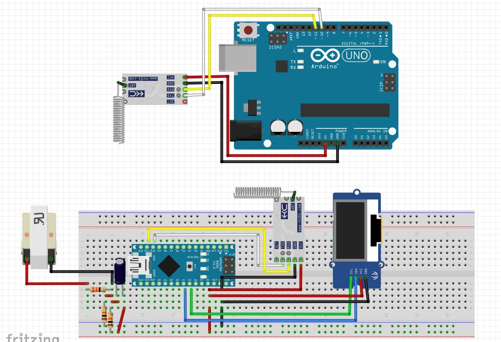
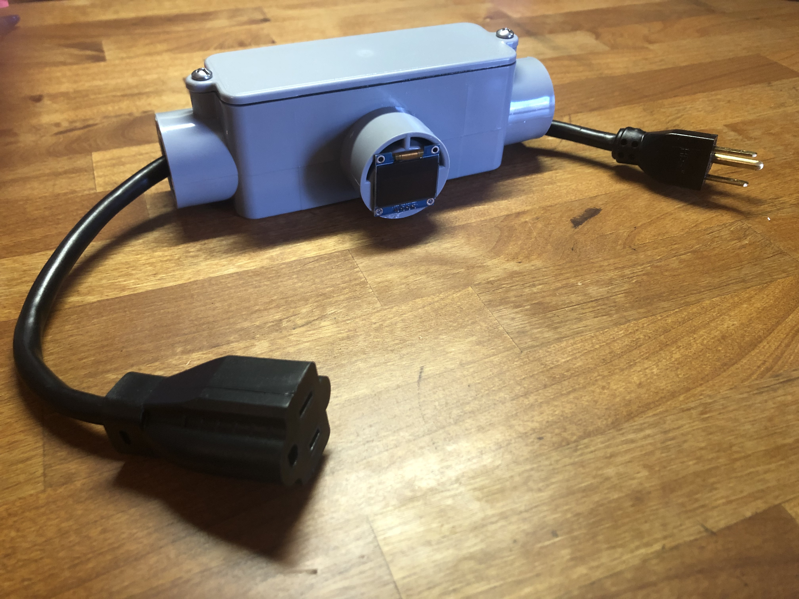

# kWh Smart Plug Project

## Designed a kWh smart plug that measures personal devices in your house in real time. Below is the Fritzing Diagram that shows the full setup of the transmitter that's connected to a current transformer on the left side of breadboard, and HC12 transceiver in the middle of the board (with the coiled antenna), and and OLED display on the right. 

## The receiver connected to an arduino uno is also connected to and HC12 transceiver to receive power readings from the nano. 

